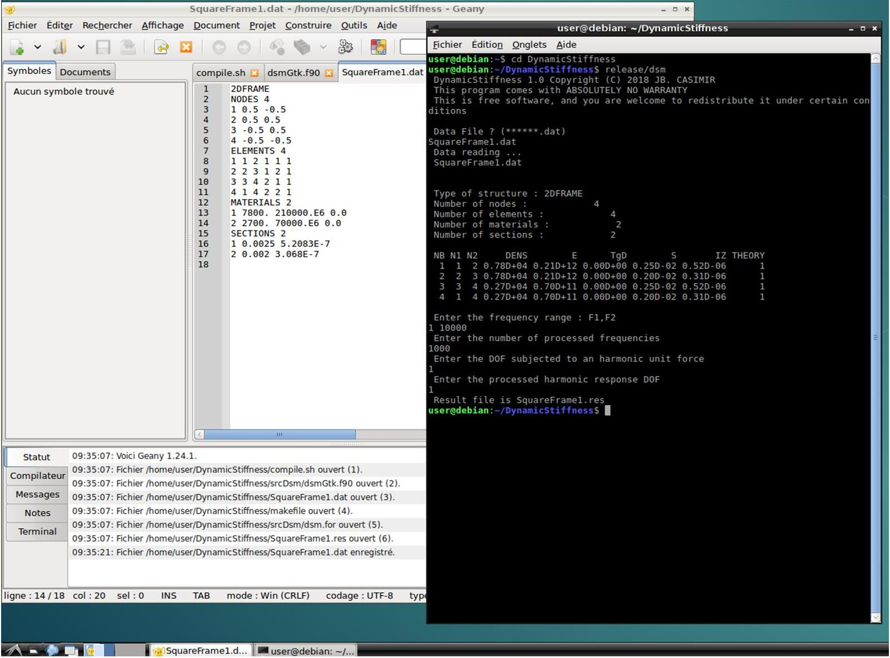
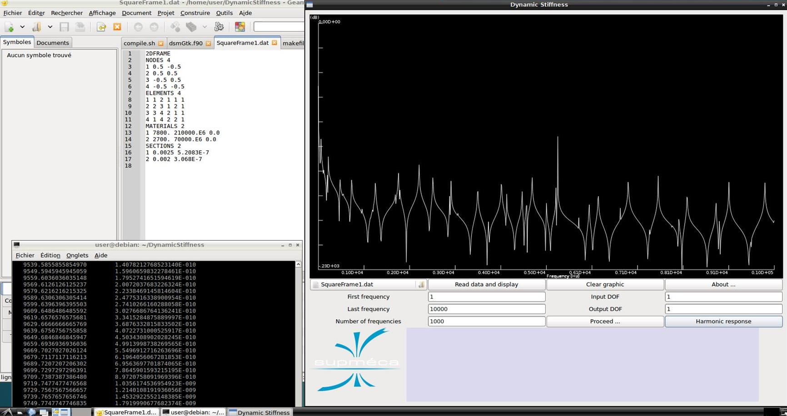

# DynamicStiffness 1.0
This package is a Fortran implementation of the Dynamic Stiffness Method.

Two main programs are given :

* dsm.for is a Fortran 77 program that calculates the harmonic response of plane frame structures.

* dsmGtk.f90 is a Fortran 90 version of dsm.for with a graphical Gtk+ interface.

Quartz Laboratory - Institut Supérieur de Mécanique de Paris [Supmeca](https://www.supmeca.fr/)
